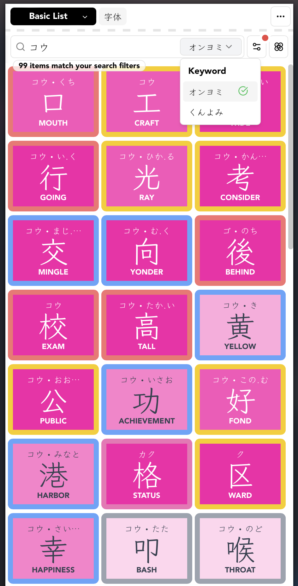
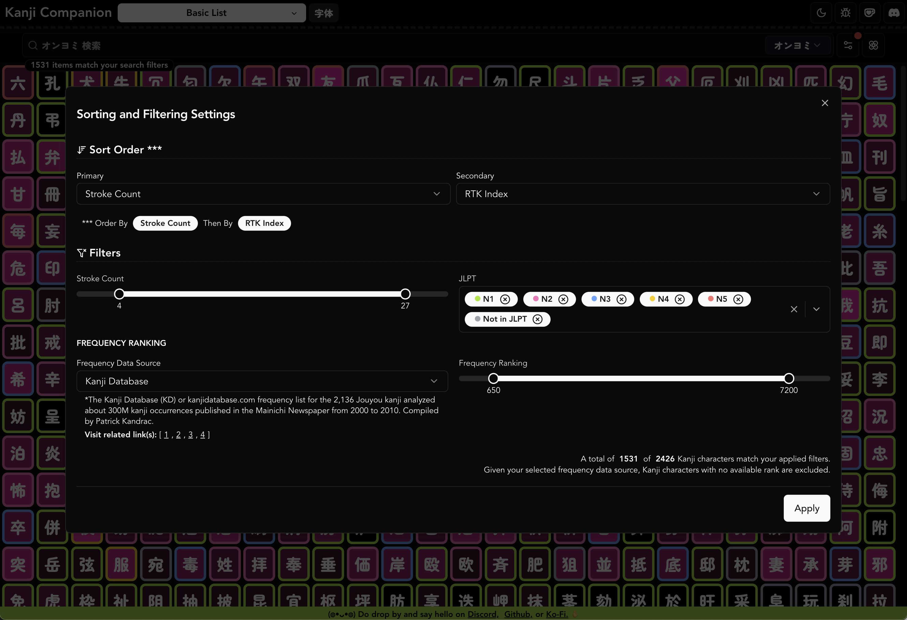

# Kanji Heatmap (previously Kanji Companion)


|  |  |
| ----------------------------------------- | ------------------------------------------ |
|                                           |                                            |



## Data (Re) Generation

## Kanji Keyword Override

If you want to override the keyword, edit the file `./DATA-SCRIPTS/original_data/PIKAPIKAGEMS_KEYWORDS.json`

```
python3 ./DATA-SCRIPTS/compress_kanji_data.py
cp ./DATA-SCRIPTS/generated/* ./public/json/

pnpm install
pnpm run peek
  ➜  Local:   http://localhost:4173/
  ➜  Network: http://192.168.254.107:4173/
  ➜  press h + enter to show help
```

`pnpm run peek` is just `# prettier --write . && eslint . && tsc -b && vite build && vite preview --host`.
The script rebuilds the data from the sources `./DATA-SCRIPTS/original_data/*` and also runs a few simple data analytics for quick inspections.

## Kanji Vocab Override

--- 🚧 🚧 WIP TODO: 🚧 🚧 ---

### Data (Re) Generation Details

Merged scraped data can be found on `./DATA-SCRIPTS/original_data/`

- `kanji.json`
- `kanji_to_vocabulary.json`
- `missing_components.json`
- `composition.json`
- `cum_use.json`
- `PIKAPIKAGEMS_KEYWORDS.json`

--- 🚧 🚧 WIP TODO: Write what the above files contain 🚧 🚧 ---

Run the script and copy generated data to public folder for `kanji-worker.ts` to access

```
python3 ./DATA-SCRIPTS/compress_kanji_data.py
cp ./DATA-SCRIPTS/generated/* ./public/json/
```

--- 🚧 🚧 WIP TODO: Write what the script does 🚧 🚧 ---

Running the python script will generate the following files
and then copy to `public/json` with `cp` so that `kanji-worker.ts` can access the data

- `kanji_main_reformatted.json`
- `kanji_other_reformatted.json`
- `word_details.json`
- `generated_reformatted_part_keyword_info.json`
- `generated_reformatted_phonetic.json`
- `cum_use.json`

```
  2118 cum_use.json
  1641 generated_reformatted_part_keyword_info.json
  2187 generated_reformatted_phonetic.json
282054 kanji_main_reformatted.json
392617 kanji_other_reformatted.json
512324 word_details.json
```

--- 🚧 🚧 TODO: Write what the above files contain 🚧 🚧 ---

## Run the app

```
pnpm install
pnpm run dev --host
pnpm run build
pnpm run preview --host

# prettier --write . && eslint . && tsc -b && vite build && vite preview --host
pnpm run peek
```

## Talk to Us

- [Discord](https://discord.gg/Ash8ZrGb4s)
- [Ko-Fi](https://ko-fi.com/minimithi")
