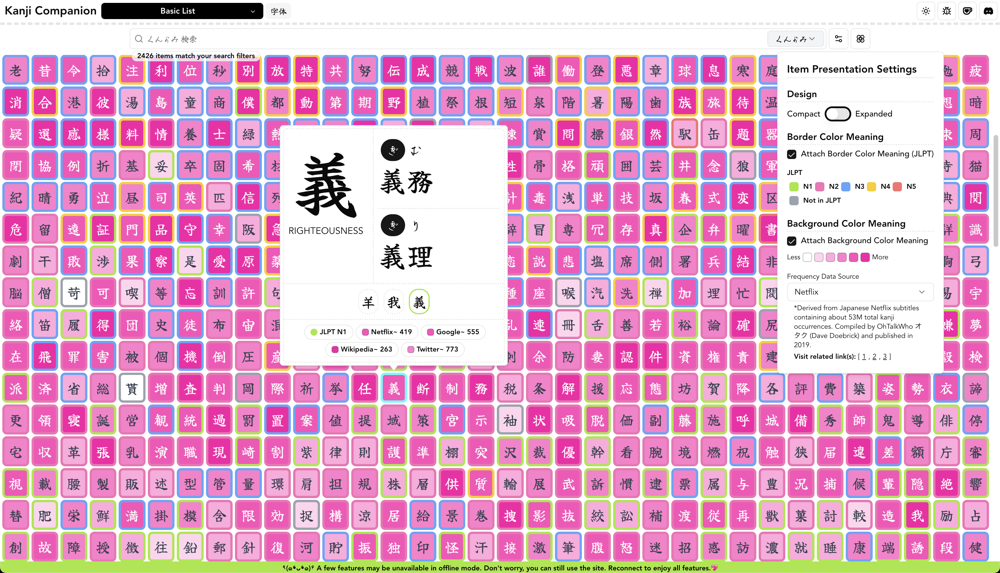

# Kanji Heatmap (previously Kanji Companion)



|  |  |
| ------------------------------------------------- | -------------------------------------------------- |
|                                                   |                                                    |


## Development

```
$ pnpm install
$ pnpm run dev --host
```

## Updating Data

If you have both [Kanji Heatmap Data](https://github.com/PikaPikaGems/kanji-heatmap-data) and this repository in the same directory, you can directly copy its output files

```
cp ../kanji-heatmap-data/output/*.json ./public/json
```

## Build Analysis

Analyze the build with

```
ANALYZE=true ANALYZE_TEMPLATE=flamegraph pnpm run build
# ANALYZE_TEMPLATE can be sunburst, treemap, network, raw-data, list, or flamegraph
```

Configure the visualizer settings in vite.config.ts if you want

## Preview

```
$ pnpm run peek
  ➜  Local:   http://localhost:4173/
  ➜  Network: http://192.168.254.107:4173/
  ➜  press h + enter to show help
```

## Updating the Data (Production)

Get the latest `tar.gz` from the [Kanji Heatmap Data](https://github.com/PikaPikaGems/kanji-heatmap-data) repository

```
curl -OL https://github.com/PikaPikaGems/kanji-heatmap-data/releases/latest/download/kanji-heatmap-data.tar.gz
```

Uncompress and store the json files in `./public/json`

```
tar -xzf ./kanji-heatmap-data.tar.gz -C ./public/json/
```

You should have the following files updated

```
ls -la public/json

    1759 component_keyword.json
    2118 cum_use.json
  369264 kanji_extended.json
  284376 kanji_main.json
    2187 phonetic.json
  200687 vocab_furigana.json
  191712 vocab_meaning.json
```

Delete the `tar.gz` file since it's not needed anymore

```
rm kanji-heatmap-data.tar.gz
```

## Talk to Us

- [Discord](https://discord.gg/Ash8ZrGb4s)
- [Ko-Fi](https://ko-fi.com/minimithi")
